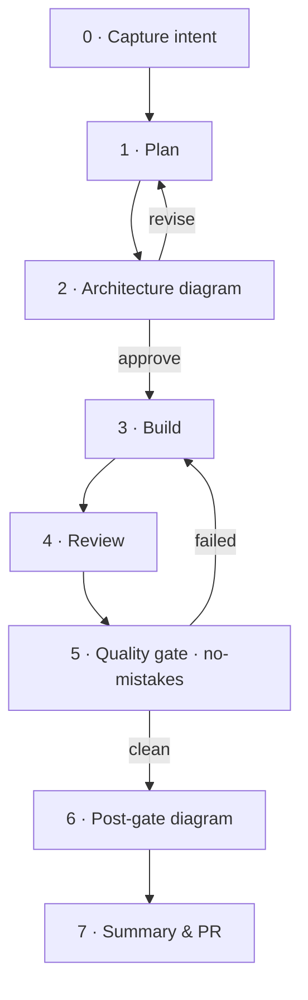

# shipshape

A single agent skill (Claude Code + Codex) that drives a code change from a
plain-English intent to a clean, reviewed, gated pull request — with up-to-date
diagrams. AI-assisted changes too often land on the remote as unreviewed slop;
shipshape puts a quality gate and a visual record in front of every PR, automatically.

It's an orchestrator: it conducts existing tools instead of reimplementing them.

## Pipeline



The hard gate is [`no-mistakes`](https://github.com/kunchenguid/no-mistakes): a local
AI git proxy that runs review → test → docs → lint → push → PR → CI in a disposable
worktree, forwards only a clean branch, and opens the PR for you. Diagrams are drawn
at plan-time (architecture, with an approval checkpoint) and after the gate (a truthful
change diagram, attached to the PR). Review runs early via `/crew` (a parallel
multi-reviewer skill) if present, else bundled review lenses; the gate enforces
tests/lint/docs regardless.

## Install (one command)

```sh
curl -fsSL https://raw.githubusercontent.com/YushengAuggie/shipshape/main/install.sh | sh
```

Or clone first, if you prefer:

```sh
git clone https://github.com/YushengAuggie/shipshape && cd shipshape && ./install.sh
```

This installs the `shipshape` skill and `no-mistakes` (the only hard dependency).
For agents other than Claude Code, set `SHIPSHAPE_SKILLS_DIR` to your skills folder.

## Use

In any git repo:

```sh
/shipshape <task>   # do the work and drive it to a clean PR
/shipshape          # gate already-committed work on the current branch
```

That's it. The skill auto-initializes `no-mistakes` for the repo on first use — no
manual setup step.

## Dependencies

The only hard dependency is `no-mistakes`; everything else is bundled or gracefully optional.

| Tier | What |
|------|------|
| Required | `no-mistakes` (installed by `install.sh`) |
| Bundled | the skill, diagram template + render script, review lenses |
| Optional | [`glimpse`](https://github.com/YushengAuggie/glimpse) live canvas (degrades to files) |
| Enhance | `/crew`, superpowers planning (used only if present) |

MIT licensed.
